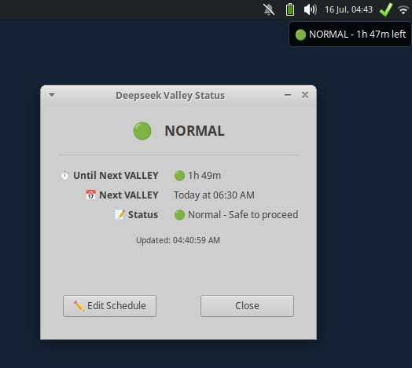

# DeepSeek Valley Indicator

> A lightweight system tray indicator for XFCE that shows when DeepSeek's "valley" periods are active to help you avoid wasting tokens.

**Since DeepSeek introduced valley timing with increased rates during peak hours, this simple indicator helps you track when to avoid using tokens and when it's safe to proceed.**

[](https://github.com/Hanzyusuf/deepseek-valley-indicator.git)

## Demo



*System tray icon showing VALLEY (🔴) and NORMAL (🟢) states with status dialog*

## Features

- 🔴/🟢 Visual status indicator in system tray
- 🕐 Automatic timezone conversion (UTC to local)
- 📅 12-hour time format
- ⏱️ Real-time remaining time display
- 🔄 Auto-updates every 30 seconds
- 🚀 Auto-starts on login
- ✏️ Edit schedule directly from menu
- 🪶 Lightweight (~15-25 MB RAM)

## Why This Exists

DeepSeek introduced **valley timing** where token usage costs more during peak hours. This indicator helps you:

- **Avoid wasting tokens** during VALLEY periods (🔴)
- **Use tokens safely** during NORMAL periods (🟢)
- **Plan ahead** by showing when the next VALLEY period starts

## Quick Installation

### 1. Clone the repository

```bash
git clone https://github.com/Hanzyusuf/deepseek-valley-indicator.git
cd deepseek-valley-indicator
```

### 2. Run installation

```bash
chmod +x install.sh
./install.sh
```

### 3. Start the indicator

```bash
~/.local/share/valley-indicator/run_indicator.sh
```

### 4. Add to panel (if icon doesn't appear)

Right-click on panel → **Panel Preferences** → **Items** → **Add** → **Status Tray**

## Configuration

### Editing schedules

The schedule is stored in `schedules.json`. You can edit it:

- Right-click the icon → **Edit Schedule**
- Or manually: `nano ~/.local/share/valley-indicator/schedules.json`

### Schedule format

```json
{
  "timezone": "UTC",
  "periods": [
    {
      "name": "VALLEY",
      "type": "peak",
      "days": ["all"],
      "start": "10:30 PM",
      "end": "03:00 AM",
      "message": "🔴 Peak hour - Avoid tokens"
    },
    {
      "name": "NORMAL",
      "type": "safe",
      "days": ["all"],
      "start": "12:00 AM",
      "end": "11:59 PM",
      "message": "🟢 Normal - Safe to proceed",
      "default": true
    }
  ]
}
```

### Periods crossing midnight

The app handles periods that cross midnight automatically. For example:
- `10:30 PM` to `03:00 AM` is treated as a single continuous VALLEY period
- No confusing "Ends at 11:59 PM" then "Starts at 12:00 AM" messages

## Usage

### Left-click on icon
Shows detailed status dialog with:
- Current state (VALLEY/NORMAL)
- Remaining time (VALLEY remaining or time until next VALLEY)
- Next VALLEY window with "Today/Tomorrow" based on local time
- Status message

### Right-click on icon
Menu options:
- **📊 Details** - Same as left-click
- **🔄 Refresh** - Manually update status
- **✏️ Edit Schedule** - Opens `schedules.json` in default editor
- **🚪 Quit** - Stop the indicator

### Hover over icon
Tooltip shows quick status information

## Commands

```bash
# Start (background)
~/.local/share/valley-indicator/run_indicator.sh

# Stop
~/.local/share/valley-indicator/stop_indicator.sh

# Check status
~/.local/share/valley-indicator/status.sh

# View logs
tail -f ~/.cache/valley-indicator/indicator.log

# Test scheduler
~/.local/share/valley-indicator/scheduler.py
```

## Resource Usage

| Resource | Usage |
|----------|-------|
| **Memory** | ~15-25 MB |
| **CPU** | ~0% (idle), ~1-3% (updating) |
| **Disk** | ~15 KB (script) |

## Troubleshooting

### Icon doesn't appear
1. Add Status Tray to panel:
   - Right-click panel → **Panel Preferences** → **Items** → **Add** → **Status Tray**
2. Restart panel: `xfce4-panel -r`
3. Check if running: `ps aux | grep valley_indicator.py`

### Indicator not updating
1. Check logs: `tail -f ~/.cache/valley-indicator/indicator.log`
2. Right-click icon → **Refresh**
3. Restart: `./stop_indicator.sh && ./run_indicator.sh`

### Timezone issues
The app uses Python's `zoneinfo` (built-in Python 3.9+) to handle timezone conversion:
- Schedule times are stored in UTC
- Automatically converted to your local timezone
- Works anywhere in the world

## Uninstallation

```bash
# Stop the process
pkill -f valley_indicator.py

# Remove all files
rm -rf ~/.local/share/valley-indicator
rm -f ~/.valley_indicator.lock
rm -f ~/.local/share/applications/valley-indicator.desktop
rm -f ~/.config/autostart/valley-indicator.desktop
rm -rf ~/.cache/valley-indicator
```

## Requirements

- **Python 3.9+** (for `zoneinfo` support)
- **XFCE** (or any desktop with systray support)
- **GTK3** (`python3-gi`, `gir1.2-gtk-3.0`)

## How It Works

1. **Schedule stored in UTC** in `schedules.json`
2. **Detects your local timezone** from system settings
3. **Converts UTC times to local** for display
4. **Checks current time** against schedule
5. **Shows status** in system tray with colored indicators
6. **Updates every 30 seconds** automatically

## Why UTC?

- **Consistent** regardless of where you are
- **Works for teams** in different timezones
- **Travel-friendly** - no need to adjust schedule

## Repository

GitHub: [https://github.com/Hanzyusuf/deepseek-valley-indicator.git](https://github.com/Hanzyusuf/deepseek-valley-indicator.git)

## License

MIT

## Contributing

Issues and pull requests welcome! Please ensure:
- Code works with Python 3.9+
- No external dependencies beyond GTK3
- Timezone handling remains robust